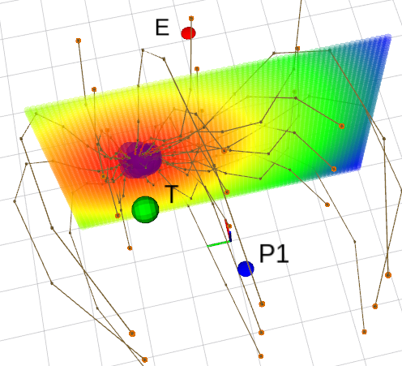
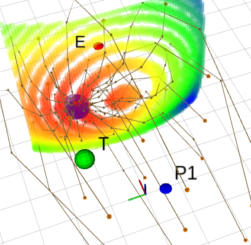
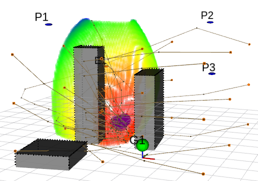

# Fast Pursuit

## Pursuit on 3D Space

A fleet of autonomous aerial vehicles protect a target from an evading intruder.

This project proposes to solve this problem using numerical solvers. To find the most likely interception point, the trajectory of the pursuers and evader are optimized simultaneously. From all the points where capture *can* happen - where a pursuer and the evader can reach simultaneously (Figure 1, interception surface) - the evader will choose the point closest to the target (Figure 1, hottest regions) to increase its chance of success. Therefore, the pursuers should move towards that point too.

### Pursuer and evader have the same speed:



In the optimization procedure, an initial interception guess (orange spheres) are iterated to decrease the path-distance to the target, while moving towards the feasible region.

### Pursuer is faster than evader:



When the drones have different speeds, the feasible region becomes a curved surface.

### Fleet of pursuers vs 1 evader in obstructed map:



When there are multiple pursuers or obstruction, the feasible region becomes complex.

### Benchmark 

On a ThinkPad W530 laptop (2.7 GHz CPU, 8GB RAM).

| Node Density [node/m] | Number of Nodes | Convergence Rate [%] | Execution Time [ms/solution] |
| --- | --- | --- | --- |
| 0.33 | 6k  | 70.01 ± 4.41  | 1.82 ± 0.07 | 
| 0.40  | 8.9k  | 70.49 ± 2.81  | 1.94 ± 0.12 | 
| 0.50  | 14k  | 57.17 ± 5.94 | 2.79 ± 0.11 | 
| 0.67  | 25k  | 58.97 ± 4.69  | 3.40 ± 0.17 | 
| 1.00  | 59k  | 46.76 ± 4.81  | 5.70 ± 0.28 | 
| 2.00  | 247k  | 87.86 ± 2.24  | 9.94 ± 0.40 | 
| 3.33  | 689k  | 77.56 ± 3.74  | 15.45 ± 0.35 | 

### How to use

Benchmark can be run without ROS:
```bash
cd pursuit
mkdir build
cd build
cmake .. -DCMAKE_BUILD_TYPE=Release
make 
./benchmark 1.0 50
```

To visualize problem, use ROS wrapper
```bash
cd catkin_ws
catkin_make -DCMAKE_BUILD_TYPE=Release && . devel/setup.bash
roslaunch pursuit_ros demo.launch
```
